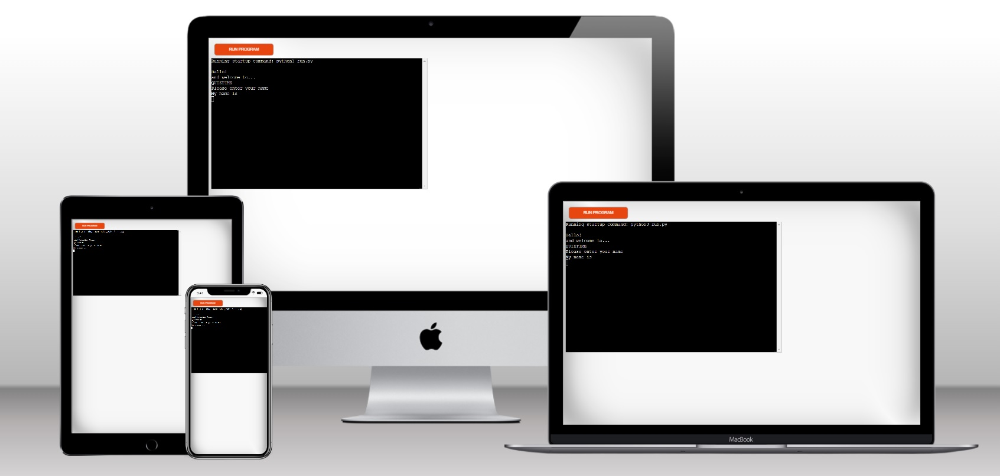
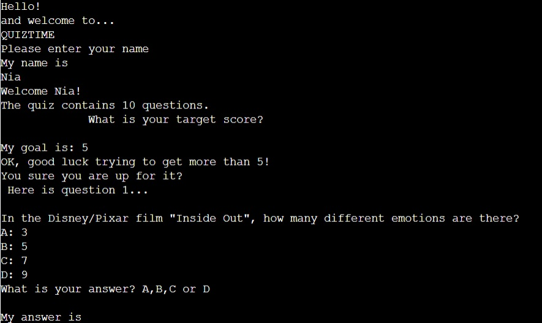
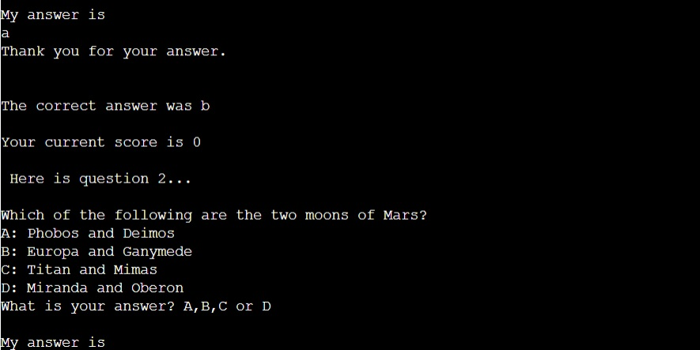
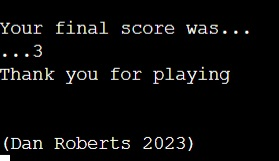

#QUIZTIME

Quiztime is a Python terminal game that uses the mock terminal by Code Institute on Heroku.

This general knowledge quiz is played by one player. Can they beat their own target?

## HOW TO PLAY

Quiztime is a general knowledge game where a player answers questions, having 4 alternatives to choose from. The questions are taken from a range of subjects. The game continues until all 10 questions are answered.

### Features

The player first enters their name and then a target score for them to try and beat. This score is out of 10.
The player will then be shown 10 questions and the 4 alternative answers. The players enter their answers by pressing the A, B, C or D keys on the keyboard and pressing enter. Their score is checked and then the correct answer is shown. Their running score is logged. Once the 10th question is answered and that score checked then the final score is revealed.

### Existing features

One player game
Player plans to beat their projected final score
Questions appear one at a time
Input validation and error checking
All four possible answer alternatives are used during the quiz

### Future features

New questions to be added
Players could type in their answer
Colours could be added to make the game more dynamic

## TESTING

The code has been run through the PEP8 validator online program.

### Bugs

#### Removed Bugs

#### Remaining Bugs

A function called display results which compares the final score and the target score to return a comment about the result has been commented out in the code.

#### Validator testing

PEP8 - online test

## DEPLOYMENT

The project was deployed using the mock terminal made by Code Institute on Herokus website.

## CREDITS

### Deployment

Code Institute for deployment terminal
Quiztime deployed via Heroku
Quiztime is an idea created and deployed by Dan Roberts 2023

### Help and guidance

GURU99.com - time delay function
(https://www.guru99.com/python-time-sleep-delay.html#:~:text=Python%20sleep()%20is%20a,the%20execution%20of%20your%20code)

Akhsat Garg - mentor at Code Institute

Problem with not loading:
Ran: pip3 install pycairo - got error 
Ran: sudo apt install libcairo2-dev pkg-config python3-dev
Ran: pip3 install pycairo - succeeded
ran: pip install gspread
transferred creds.json file in
Success!

https://www.youtube.com/watch?v=4zbehnz-8QU
Color and text format:
pip install rich
from rich import print ( adds color to numbers)
from rich.console import Console (add color to by adding console to print ie console.print and adding stylings)
from rich.text import Text (same as above but more individual)
from rich.theme import Theme (add themes and then repeat using console.print and adding stylings code)
    emojis can also be added for example :apple adds an apple emoji
from rich.Table import Table (table.add_column etc or table.add_row)