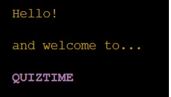

# QUIZTIME

Quiztime is a Python terminal game that uses the mock terminal by Code Institute on Heroku.

This general knowledge quiz is played by one player. They set a target but can they beat it?

---------------

## Table of contents

1. How to play Quiztime 
    1.1 Basic Rules 
2. Planning 
    2.1 Aim of simplicity 
    2.2 Used languages 
3. Layout & Design 
    3.1 Website structure 
    3.2 Page layout 
    3.3 Icons 
4. Description of game screen 
    4.1 Interactive parts 
    4.2 Non-interactive parts 
5. Important code functions 
    5.1 JavaScript functions 
    5.2 Python start code 
6. Testing, issues & Bugs 
    6.1 Online tests 
    6.2 Manual testing 
7. Issues & Bugs 
    7.1 Resolved issues 
    7.2 Unresolved issues 
    7.3 Possible future developments 
    7.4 Validator testing 
8. Deployment 
    8.1 Github deployment 
    8.2 Link 
9. 404 page 
    9.1 Page layout 
    9.2 Interactive parts 
    9.3 Non-interactive parts 
10. Credits 
    10.1 Credits, references and thanks 

---------------

## 1. How to play

Quiztime is a general knowledge game where a player answers questions, having 4 alternatives to choose from. The questions are taken from a range of subjects. The game continues until the chosen set of 10 questions are answered.

#### 1.1 Basic Rules:

The game starts...

...and the player enters their chosen name

The user will be asked what their chosen difficulty level of their 10 questions would be

They can choose between easy

medium

or hard

Their next choice is to set their target. They can choose between 1 and 10.
If they set 1 and 5

or between 6 and 10

The player will then be shown the first question and it's 4 alternative answers. 

The players enter their answers by pressing the A, B, C or D keys on the keyboard and pressing enter. The answer is revealed and their current score is also updating after every answer.

An incorrect answer give a score of 0 for that question

While a correct answer gives a score of 1 for that question

A total of 10 questions
Their score is checked and then the correct answer is shown.

Their running score is logged.

Once the 10th question is answered, that score checked then the final score is revealed and also if the user beat their target score!

Their results are then saved and stored in the same database that stores the questions

### Features

  This score is out of 10.
   

### Existing features

One player game
Player plans to beat their projected final score
Questions appear one at a time
Input validation and error checking
All four possible answer alternatives are used during the quiz

### Future features

New questions to be added
Players could type in their answer
Colours could be added to make the game more dynamic

## TESTING

The code has been run through the PEP8 validator online program.

### Bugs

#### Removed Bugs

#### Remaining Bugs

A function called display results which compares the final score and the target score to return a comment about the result has been commented out in the code.

#### Validator testing

PEP8 - online test

## DEPLOYMENT

The project was deployed using the mock terminal made by Code Institute on Herokus website.

## CREDITS

### Deployment

Code Institute for deployment terminal
Quiztime deployed via Heroku
Quiztime is an idea created and deployed by Dan Roberts 2023

### Help and guidance

GURU99.com - time delay function
(https://www.guru99.com/python-time-sleep-delay.html#:~:text=Python%20sleep()%20is%20a,the%20execution%20of%20your%20code)

Akhsat Garg - mentor at Code Institute

Problem with not loading:
sudo apt install libcairo2-dev pkg-config python3-dev
pip3 install pycairo
pip install gspread
pip install -r requirements.txt
python3 run.py

https://www.youtube.com/watch?v=4zbehnz-8QU
Color and text format:
pip install rich
from rich import print ( adds color to numbers)
from rich.console import Console (add color to by adding console to print ie console.print and adding stylings)
from rich.theme import Theme (add themes and then repeat using console.print and adding stylings code)

