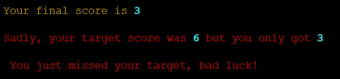
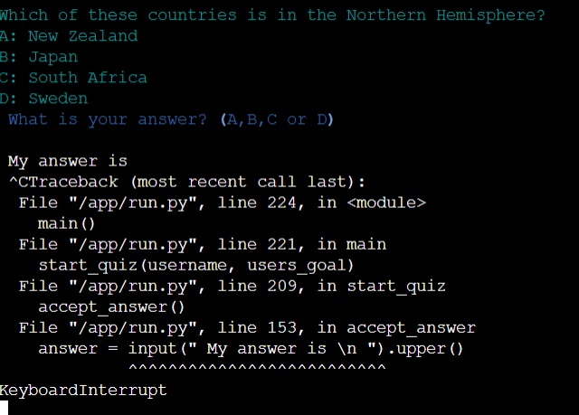

# QUIZTIME

**Quiztime is a Python terminal game that uses the mock terminal by Code Institute on Heroku**

This general knowledge quiz is played by one player. They set a target but can they beat it?

-------------

## Table of contents

1. What is Quiztime? 
    1.1 Brief introduction 
    1.2 Basic mechanics 
    1.3 Link to Quiztime 
2. Planning 
    2.1 What? Why? Who? 
    2.2 User Stories 
3. Gameplay & Design 
    3.1 Gameplay 
    3.2 Excel file 
    3.3 Interactability 
5. Important code functions 
    5.1 JavaScript functions 
    5.2 Python start code 
6. Testing, issues & Bugs 
    6.1 Online tests 
    6.2 Manual testing 
7. Issues & Bugs 
    7.1 Resolved issues 
    7.2 Unresolved issues 
    7.3 Possible future developments 
    7.4 Validator testing 
8. Deployment 
    8.1 Github deployment 
    8.2 Link 
9. 404 page 
    9.1 Page layout 
    9.2 Interactive parts 
    9.3 Non-interactive parts 
10. Credits 
    10.1 Credits, references and thanks 

---------------

## 1. What is Quiztime?

#### 1.1 Brief Intruction

- Quiztime is a general knowledge game
- There are 3 difficulty levels to choose from
- Users set their target for correct answers before they start
- Questions come with 4 possible answers alternatives to choose from
- When all 10 questions are answered, the scores and targets are checked and logged

#### 1.2 Basic mechanics

- Quiztime is run on a mock Python terminal created by Code Institute
- It is connected to an excel file which not only supplies the questions but stores the results
- An import of rich has been used to provide color to text
- The project is deployed via Heroku

#### 1.3 Link to Quiztime

Quiztime can be found using this [link](https://quiztime.herokuapp.com/)

---------------

## 2. Planning

#### 2.1 What? Why? Who?

What is the project about?

- This project aims to show the python terminal and several functions that show that a simple Python project can create a basic but interesting game

Why choose this project?

- I am interesting in quizzes and so it was interesting to me to design a quiz game using this (relatively) simplistic form of Python
- This was very challenging but it has also helped me to learn more not only about Python but coding in general

Who is this project aimed at?

- The kind of people who I feel would like this project would either be people interested in general knowledge quizzes or people who have an interest in how Python can work

#### 2.2 User Stories

*Developer*

- As a **developer** I can **create easy to follow instructions** so that **I can provide a game that is fun immediately**
- As a **developer** I can **create a target score function** so that **I can give the user a heightened sense of challenge**
- As a **developer** I can **add small time delays** so that **users can easily see when things have been added to the screen**
- As a **developer** I can **create questions that are concise and easy to understand** so that **the game is not confusing for the user and to provide a good user experience**
- As a **developer** I can **provide questions on a range of topics** so that **I can provide a variety of questions that challenges all different subjects for the user**
- As a **developer** I can **create a range of difficulties** so that **the user is finds the game more challenging and more dynamic**
- As a **developer** I can **provide multiple choice answers per question** in order to **make the answering easier by providing choices for the user instead of asking them to type out an answer**
- As a **developer** I can **check users answer after every question** so that **the user is kept updated and involved in their progress**
- As a **developer** I can **a visual that has alternating colours** in order to **give the game a less dull appearance despite its text-only visuals**
- As a **developer** I can **create a database for questions** so that **it is easier to add or update questions or topics
- As a **developer** I can **create a database to store user information** so that **I can monitor the difficulty levels and how often the quiz is played**
- As a **developer** I can **create functioning error handling** so that **the game doesn’t crash if an incorrect value is entered by the user**

*User*

- As a **user** I can **see instructions**, so that **I can understand the game quickly to make playing more enjoyable**
- As a **user** I can **enter my name**, so that **I feel personally attached to the game to heighten my experience**
- As a **user** I can **Play different levels**, so that **I am able to play the game many times over and find it enjoyable**
- As a **user** I can **Have several possible options**, in order to **to provide a challenge of choosing the correct answer to questions I’m not sure about**
- As a **user** I can **See what the correct was after every question**, in order to **to inform me of the correct answer if I did get the answer wrong**
- As a **user** I can **Store my details**, in order to **provide feedback to the developer for possible improvements**

---------------

## 3. Gameplay & Design

#### 3.1 Gameplay:

On page loading, the game starts

...and the player enters their chosen name

The user will be asked what their chosen difficulty level of their 10 questions would be

They can choose between easy...

...medium...

...or hard

Their next choice is to set their target. They can choose between 1 and 10.
If they set 1 and 5

or between 6 and 10

The player will then be shown the first question and it's 4 alternative answers. 

The players enter their answers by pressing the A, B, C or D keys on the keyboard and pressing enter.
The answer is revealed and their current score is also updating after every answer.

An incorrect answer will give a score of 0 for that question

While a correct answer gives a score of 1 for that question

After all 10 questions are answered, the results of the quiz and if the target was beaten are calculated
If the user doesn't beat their target

If the user matches their target

If the user beats their target

Their results are then saved and stored in the same database that stores the questions and the final message is displayed

**New Game and cancel game**

A new game can be run by pressing the "run program" button at the top of the page

A game can be canceled during play by holding the ctrl button and pressing the c key on your keyboard

#### 3.2 Excel file

The excel file called quiztime is connected through the gspread import.

In total there are 5 tabs in the file
- "easy" containing the 10 easy questions
- "medium" containing the 10 medium questions
- "hard" containing the 10 medium questions
- "all_questions" containing all questions
- "results" containing a list of the completed user quizzes and their total score

#### 3.3 Interactability

**Interactive buttons**

There is one clickable button and that is above the mock terminal
- the "run program" button as shown in 3.1

As the program uses the terminal the keyboard is most important and these uses for keys are as follows:
- entering username (whole keyboard + enter)
- choosing difficulty level (1,2 or 3 + enter)
- setting target goal (1-10 + enter)
- answering questions (A,B,C or D + enter)
- canceling a game (holding ctrl button while pressing the c key)

--------

### Features

  This score is out of 10.
   

### Existing features

One player game
Player plans to beat their projected final score
Questions appear one at a time
Input validation and error checking
All four possible answer alternatives are used during the quiz

### Future features

New questions to be added
Players could type in their answer
Colours could be added to make the game more dynamic

## TESTING

The code has been run through the PEP8 validator online program.

### Bugs

#### Removed Bugs

#### Remaining Bugs

A function called display results which compares the final score and the target score to return a comment about the result has been commented out in the code.

#### Validator testing

PEP8 - online test

## DEPLOYMENT

The project was deployed using the mock terminal made by Code Institute on Herokus website.

## CREDITS

### Deployment

Code Institute for deployment terminal
Quiztime deployed via Heroku
Quiztime is an idea created and deployed by Dan Roberts 2023

### Help and guidance

GURU99.com - time delay function
(https://www.guru99.com/python-time-sleep-delay.html#:~:text=Python%20sleep()%20is%20a,the%20execution%20of%20your%20code)

Akhsat Garg - mentor at Code Institute

Problem with not loading:
sudo apt install libcairo2-dev pkg-config python3-dev
pip3 install pycairo
pip install gspread
pip install -r requirements.txt
python3 run.py

https://www.youtube.com/watch?v=4zbehnz-8QU
Color and text format:
pip install rich
from rich import print ( adds color to numbers)
from rich.console import Console (add color to by adding console to print ie console.print and adding stylings)
from rich.theme import Theme (add themes and then repeat using console.print and adding stylings code)

