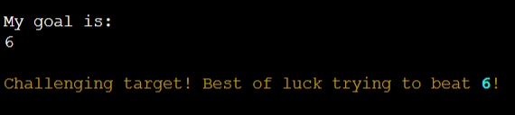
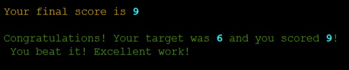

# QUIZTIME

**Quiztime is a Python terminal game that uses the mock terminal by Code Institute on Heroku**

This general knowledge quiz is played by one player. They set a target but can they beat it?

---------------

## Table of contents

1. What is Quiztime? 
    1.1 Brief introduction 
    1.2 Basic mechanics 
    1.3 Link to Quiztime 
2. Planning 
    2.1 What? Why? Who? 
    2.2 User Stories 
3. Gameplay & Design 
    3.1 Gameplay 
    3.2 Page layout 
    3.3 Icons 
4. Description of game screen 
    4.1 Interactive parts 
    4.2 Non-interactive parts 
5. Important code functions 
    5.1 JavaScript functions 
    5.2 Python start code 
6. Testing, issues & Bugs 
    6.1 Online tests 
    6.2 Manual testing 
7. Issues & Bugs 
    7.1 Resolved issues 
    7.2 Unresolved issues 
    7.3 Possible future developments 
    7.4 Validator testing 
8. Deployment 
    8.1 Github deployment 
    8.2 Link 
9. 404 page 
    9.1 Page layout 
    9.2 Interactive parts 
    9.3 Non-interactive parts 
10. Credits 
    10.1 Credits, references and thanks 

---------------

## 1. What is Quiztime?

#### 1.1 Brief Intruction

- Quiztime is a general knowledge game
- There are 3 difficulty levels to choose from
- Users set their target for correct answers before they start
- Questions come with 4 possible answers alternatives to choose from
- When all 10 questions are answered, the scores and targets are checked and logged

#### 1.2 Basic mechanics

- Quiztime is run on a mock Python terminal created by Code Institute
- It is connected to an excel file which not only supplies the questions but stores the results
- The project is deployed via Heroku

#### 1.3 Link to Quiztime

Quiztime can be found using this [link](https://quiztime.herokuapp.com/)

---------------

## 2. Planning

#### 2.1 What? Why? Who?

What is the project about?

- This project aims to show the python terminal and several functions that show that a simple Python project can create a basic but interesting game

Why choose this project?

- I am interesting in quizzes and so it was interesting to me to design a quiz game using this (relatively) simplistic form of Python
- This was very challenging but it has also helped me to learn more not only about Python but coding in general

Who is this project aimed at?

- The kind of people who I feel would like this project would either be people interested in general knowledge quizzes or people who have an interest in how Python can work

#### 2.2 User Stories

#### 1.1 Gameplay and screenshots:

The game starts...

...and the player enters their chosen name

The user will be asked what their chosen difficulty level of their 10 questions would be

They can choose between easy

medium

or hard

Their next choice is to set their target. They can choose between 1 and 10.
If they set 1 and 5

or between 6 and 10

The player will then be shown the first question and it's 4 alternative answers. 

The players enter their answers by pressing the A, B, C or D keys on the keyboard and pressing enter.
The answer is revealed and their current score is also updating after every answer.

An incorrect answer give a score of 0 for that question

While a correct answer gives a score of 1 for that question

After all 10 questions are answered, the results of the quiz and if the target was beaten are calculated
If the user doesn't beat their target

If the user matches their target

If the user beats their target

Their results are then saved and stored in the same database that stores the questions and the final message is displayed

### Features

  This score is out of 10.
   

### Existing features

One player game
Player plans to beat their projected final score
Questions appear one at a time
Input validation and error checking
All four possible answer alternatives are used during the quiz

### Future features

New questions to be added
Players could type in their answer
Colours could be added to make the game more dynamic

## TESTING

The code has been run through the PEP8 validator online program.

### Bugs

#### Removed Bugs

#### Remaining Bugs

A function called display results which compares the final score and the target score to return a comment about the result has been commented out in the code.

#### Validator testing

PEP8 - online test

## DEPLOYMENT

The project was deployed using the mock terminal made by Code Institute on Herokus website.

## CREDITS

### Deployment

Code Institute for deployment terminal
Quiztime deployed via Heroku
Quiztime is an idea created and deployed by Dan Roberts 2023

### Help and guidance

GURU99.com - time delay function
(https://www.guru99.com/python-time-sleep-delay.html#:~:text=Python%20sleep()%20is%20a,the%20execution%20of%20your%20code)

Akhsat Garg - mentor at Code Institute

Problem with not loading:
sudo apt install libcairo2-dev pkg-config python3-dev
pip3 install pycairo
pip install gspread
pip install -r requirements.txt
python3 run.py

https://www.youtube.com/watch?v=4zbehnz-8QU
Color and text format:
pip install rich
from rich import print ( adds color to numbers)
from rich.console import Console (add color to by adding console to print ie console.print and adding stylings)
from rich.theme import Theme (add themes and then repeat using console.print and adding stylings code)

