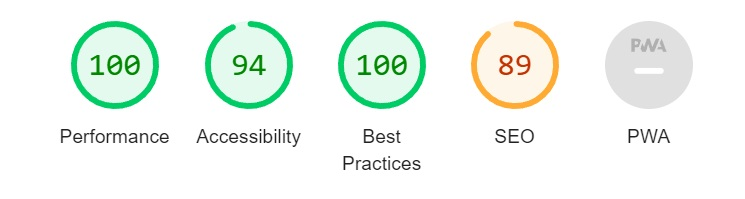
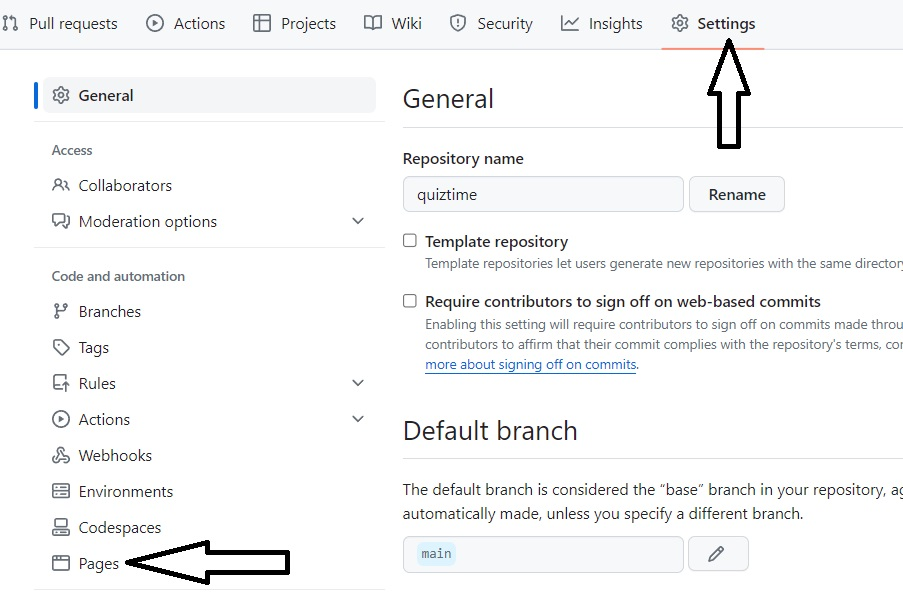

# QUIZTIME

**Quiztime is a Python terminal game that uses the mock terminal by Code Institute on Heroku**

This general knowledge quiz is played by one player. They set a target but can they beat it?

-------------

## Table of contents

1. What is Quiztime? 
    1.1 Brief introduction 
    1.2 Basic mechanics 
    1.3 Link to Quiztime 
2. Planning 
    2.1 What? Why? Who? 
    2.2 User Stories 
3. Gameplay & Design 
    3.1 Gameplay 
    3.2 Excel file 
    3.3 Interactability 
4. Important code functions 
    4.1 Python functions 
    4.2 Python start code 
5. Testing 
    5.1 Manual testing 
    5.2 Other tests 
6. Issues & Bugs 
    6.1 Resolved issues 
    6.2 Unresolved issues 
    6.3 Possible future developments 
7. Deployment 
    7.1 Github deployment 
    7.2 Heroku deployment 
    7.3 Setting up an API in Google sheets 
8. Credits 
    8.1 Credits 
    8.2 References 
    8.3 Thanks 

---------------

## 1. What is Quiztime?

#### 1.1 Brief Intruction

- Quiztime is a general knowledge game
- There are 3 difficulty levels to choose from
- Users set their target for correct answers before they start
- Questions come with 4 possible answers alternatives to choose from
- When all 10 questions are answered, the scores and targets are checked and logged

#### 1.2 Basic mechanics

- Quiztime is run on a mock Python terminal created by Code Institute
- It is connected to an excel file which not only supplies the questions but stores the results
- An import of rich has been used to provide color to text
- The project is deployed via Heroku

#### 1.3 Link to Quiztime

Quiztime can be found [here](https://quiztime.herokuapp.com/)

---------------

## 2. Planning

#### 2.1 What? Why? Who?

What is the project about?

- This project aims to show the python terminal and several functions that show that a simple Python project can create a basic but interesting game

Why choose this project?

- I am interesting in quizzes and so it was interesting to me to design a quiz game using this (relatively) simplistic form of Python
- This was very challenging but it has also helped me to learn more not only about Python but coding in general

Who is this project aimed at?

- The kind of people who I feel would like this project would either be people interested in general knowledge quizzes or people who have an interest in how Python can work

#### 2.2 User Stories

*Developer*

- As a **developer** I can **create easy to follow instructions** so that **I can provide a game that is fun immediately**
- As a **developer** I can **create a target score function** so that **I can give the user a heightened sense of challenge**
- As a **developer** I can **add small time delays** so that **users can easily see when things have been added to the screen**
- As a **developer** I can **create questions that are concise and easy to understand** so that **the game is not confusing for the user and to provide a good user experience**
- As a **developer** I can **provide questions on a range of topics** so that **I can provide a variety of questions that challenges all different subjects for the user**
- As a **developer** I can **create a range of difficulties** so that **the user is finds the game more challenging and more dynamic**
- As a **developer** I can **provide multiple choice answers per question** in order to **make the answering easier by providing choices for the user instead of asking them to type out an answer**
- As a **developer** I can **check users answer after every question** so that **the user is kept updated and involved in their progress**
- As a **developer** I can **a visual that has alternating colours** in order to **give the game a less dull appearance despite its text-only visuals**
- As a **developer** I can **create a database for questions** so that **it is easier to add or update questions or topics
- As a **developer** I can **create a database to store user information** so that **I can monitor the difficulty levels and how often the quiz is played**
- As a **developer** I can **create functioning error handling** so that **the game doesn’t crash if an incorrect value is entered by the user**

*User*

- As a **user** I can **see instructions**, so that **I can understand the game quickly to make playing more enjoyable**
- As a **user** I can **enter my name**, so that **I feel personally attached to the game to heighten my experience**
- As a **user** I can **Play different levels**, so that **I am able to play the game many times over and find it enjoyable**
- As a **user** I can **Have several possible options**, in order to **to provide a challenge of choosing the correct answer to questions I’m not sure about**
- As a **user** I can **See what the correct was after every question**, in order to **to inform me of the correct answer if I did get the answer wrong**
- As a **user** I can **Store my details**, in order to **provide feedback to the developer for possible improvements**

---------------

## 3. Gameplay & Design

#### 3.1 Gameplay:

On page loading, the game starts

...and the player enters their chosen name

The user will be asked what their chosen difficulty level of their 10 questions would be

They can choose between easy...

...medium...

...or hard

Their next choice is to set their target. They can choose between 1 and 10.
If they set 1 and 5

or between 6 and 10

The player will then be shown the first question and it's 4 alternative answers. 

The players enter their answers by pressing the A, B, C or D keys on the keyboard and pressing enter.
The answer is revealed and their current score is also updating after every answer.

An incorrect answer will give a score of 0 for that question

While a correct answer gives a score of 1 for that question

After all 10 questions are answered, the results of the quiz and if the target was beaten are calculated
If the user doesn't beat their target

If the user matches their target

If the user beats their target

Their results are then saved and stored in the same database that stores the questions and the final message is displayed

**New Game and cancel game**

A new game can be run by pressing the "run program" button at the top of the page

A game can be canceled during play by holding the ctrl button and pressing the c key on your keyboard

#### 3.2 Excel file

The excel file called quiztime is connected through the gspread import.

In total there are 5 tabs in the file
- "easy" containing the 10 easy questions
- "medium" containing the 10 medium questions
- "hard" containing the 10 medium questions
- "all_questions" containing all questions
- "results" containing a list of the completed user quizzes and their total score

#### 3.3 Interactability

**Interactive buttons**

There is one clickable button and that is above the mock terminal
- the "run program" button as shown in 3.1

As the program uses the terminal the keyboard is most important and these uses for keys are as follows:
- entering username (whole keyboard + enter)
- choosing difficulty level (1,2 or 3 + enter)
- setting target goal (1-10 + enter)
- answering questions (A,B,C or D + enter)
- canceling a game (holding ctrl button while pressing the c key)

--------

## 4. Important code functions

#### 4.1 Python functions

In this part, I will list the functions used in this project and give a brief description of what is does.
The following functions make up the core of this project:

**show_welcome_screencreen()**

The start function
- Displays the project name and welcomes the player

**get_player_name()**

First function that needs an input from the player
- Asks for username to be entered
- Checks the username is not an empty string otherwise it returns an error
- Returns the username to be used in later functions

**choose_difficulty()**

Provides a choice of three difficulties and then links to the choosing of the questions
- Informs user of the three options (easy, medium, hard)
- Asks for user to return a number related to the chosen difficulty
- Checks the number is a 1,2 or 3 otherwise it returns an error
- Connects the number returned to a list of the names of the difficulty levels

**initialise_questions(difficulty)**

Uses the difficulty level chosen in choose_difficulty to match with the necessary excel tab
- Selects the tab using the difficulty level chosen in previous function
- Loads questions stored in that excel tab related to that difficulty level

**target_score()**

Asks for users target score then stores it for later comparison after the end of the quiz
- Informs user of number of questions
- Asks user to enter a target between 1 and 10
- Checks that what is entered is between 1 and 10 otherwise it returns an error
- It prints an acceptance if the figure is between 1 and 10
- Prints two responses depending if the target is "low" (1-5) or "high" (6-10)
- Returns the users_goal to be used in later functions

**ask_question()**

Asks the questions previously loaded in initialise_questions
- Finds the next question to ask the user
- Displays question and it's possible answer alternatives
- Keeps asking until all questions count is = 10

**accept_answer()**

Asks for answer to question, then checks if the answer is correct against the stored correct answer
- Asks user to enter an answer of A, B, C or D
- Checks that what is entered is either A, B, C or D otherwise it returns an error
- If answer is correct, it informs the user and adds +1 to the users current score
- If answer is incorrect, it informs the user and adds nothing to users current score

**display_results(username, users_goal)**

Compares users target score with their actual score
- Checks if the actual score is greater than, equal to or lesser than the target score
- Displays a message to inform the user depending on the three outcomes
- Scores are then stored in the excel file in the "results" tab (username and score)

#### 4.2 Python start code

The main code that I have used to run the project in my IDE is:
- python3 run.py

-------------

## 5. Testing

#### 5.1 Manual testing

| Nr | Section                 | Action                                                     | Expected result                                                                                                          | Correct outcome? |
| -- | ----------------------- | ---------------------------------------------------------- | ------------------------------------------------------------------------------------------------------------------------ | ---------------- |
| 1  | Enter name              | Enter a blank space instead of name                        | Error message - “Name cannot be empty. Please enter your name”                                                           | Yes              |
| 2  | Enter name              | Enter a name                                               | “Welcome {username}!”                                                                                                    | Yes              |
| 3  | Choose difficulty level | Enter a letter instead of 1, 2 or 3                        | Error message “Invalid data: {error}. Please try again.”                                                                 | No - see below    |
| 4  | Choose difficulty level | Enter a number not 1,2 or 3                                | Error message “Invalid data: {error}. Please try again.”                                                                 | Yes              |
| 5  | Choose difficulty level | Enter a number that is 1,2 or 3                            | “You have chosen the {users_difficulty} difficulty level”                                                                | Yes              |
| 6  | Target score            | Enter a letter instead of a number between 1 & 10          | Error message “Invalid data: {error}Please try again.                                                                    | No - see below    |
| 7  | Target score            | Enter a number not between 1 & 10                          | Error message “Invalid data: {error}Please try again.                                                                    | Yes              |
| 8  | Target score            | Enter a number between 1 & 5                               | “{users_goal} is your score to beat, good luck!”                                                                         | Yes              |
| 9  | Target score            | Enter a number between 5 & 10                              | Challenging target! Best of luck trying to beat {users_goal}!”                                                           | Yes              |
| 10 | Answer question         | Enter a letter that is not A, B, C or D                    | Error message “Invalid data: You can only answer with A, B, C or D. Please try again.”                                   | Yes              |
| 11 | Answer question         | Enter a number instead of A, B, C or D                     | Error message “Invalid data: You can only answer with A, B, C or D. Please try again.”                                   | Yes              |
| 12 | Answer question         | Enter the letter that matches the correct answer           | “Good answer, {correct_answer} was correct!”                                                                             | Yes              |
| 13 | Answer question         | Enter the letter that matches an incorrect answer          | 1: “Thank you for your answer.\\nThe correct answer was {correct_answer}” 2: "The answer {answer} was incorrect”      | Yes              |
| 14 | End Result              | Check that the final score is displayed correctly          | Final score should be correct and this message should be shown with the correct result: “Your final score is {score}” | Yes              |
| 15 | End Result              | Answering all questions so that target score is not beaten | 1: "Sadly, your target score was {users_goal} but you only got {score}“ 2: "You just missed your target, bad luck!”   | Yes              |
| 16 | End Result              | Answering all questions so that target score is equalled   | 1: "Well done! Your target score was {users_goal} and you matched it!” 2: "You hit your target, well done!"           | Yes              |
| 17 | End Result              | Answering all questions so that target score is beaten     | 1: "Congratulations! Your target was {users_goal} and you scored {score}!" 2: "You beat it! Excellent work!"          | Yes              |
| 18 | End Result              | Check that “scores being saved” appears                    | Scores are being saved to the history books”                                                                             | Yes              |
| 19 | End Result              | Check that username and score are saved to excel file      | Check in tab “results” that username and score appears                                                                   | Yes              |

**Tests without expected outcome**

- Test nr.3 - Choose difficulty level 
On entering a letter instead of a number, the following message is displayed:
“Invalid data: invalid literal for int() with base 10: 'a'Please try again.” 
There should be an extra error handling inserted to replace that text

- Test nr.6 - Target score 
On entering a letter instead of a number, the following message is displayed:
“Invalid data: invalid literal for int() with base 10: 'a'Please try again.” 
There should be an extra error handling inserted to replace that text

#### 5.2 Other tests

Deployed to Heroku - final deployment

Multi Device Website Mockup Generator

Lighthouse - Google desktop

Lighthouse - Google mobile

PEP8 - online test

After running a [website checker](https://try.powermapper.com/Demo/Report/f1734f42-b9fa-48aa-bd3b-01e384b57678), it returned the following issues:
- *Critical*	This page has no h1 element, which violates Bing webmaster guidelines.
Have now added an h1 element to index.html

Also in the report from powermapper, it shows that it is compatible with the following webpages:

-----------

## 6. Issues & Bugs

#### 6.1 Resolved issues

Using the feedback from the assessor, I created a table with issues that were raised so I could accurately improve the key points that they have raised through my assessment feedback

| Feedback point                                                                                                                                                                                                                                                                                                                                                                                                                                                                      | Ideas/Method                                                                                                                                                             | Done? |
| ----------------------------------------------------------------------------------------------------------------------------------------------------------------------------------------------------------------------------------------------------------------------------------------------------------------------------------------------------------------------------------------------------------------------------------------------------------------------------------- | ------------------------------------------------------------------------------------------------------------------------------------------------------------------------ | ----- |
| Overall functionality works well with minor bugs                                                                                                                                                                                                                                                                                                                                                                                                                                    | Remove bugs                                                                                                                                                              | Yes   |
| The recorded features in the README file indicate that the Python function is working correctly, but it lacks some customized designs to make the interaction more complex. The code has passed the PEP8 check, but known bugs have not been resolved. The project is designed to be simple and user-friendly, with clear on-screen options for the user. Error handling should be improved so that the program will not break easily. The program accepts blank input and crashes. | Customized designs are lacking Error handling needs to be improved Program accepts blank input then crashes                                                        | Yes   |
| The inconsistent flow of data between functions causes the application to break                                                                                                                                                                                                                                                                                                                                                                                                     | Improve flow of data between functions                                                                                                                                   | Yes   |
| The system includes a suitable mechanism to handle empty or invalid input data for the answer inputs. However, there is no error handling on the username inputs and the goal score inputs. The invalid input can break the program easily. Please also ensure the goal score should not allow to be more than 10.                                                                                                                                                                  | No error handling on username inputs and goal score inputs Ensure the goal score should not allow to be more than 10                                                  | Yes   |
| Absence of Exception/error handling causes the application to crash                                                                                                                                                                                                                                                                                                                                                                                                                 | Exception/error handling needed                                                                                                                                          | Yes   |
| The PEP8 validation tool is mentioned in the README file, and results are documented, but detailed testing steps and guidelines are missing. Please also add the details to the testing section.                                                                                                                                                                                                                                                                                    | Detailed testing steps are missing Add details to the testing section README                                                                                          | Yes   |
| This project used the external resource - google sheets to store the quiz questions. But the current interactions are not complex enough. Please dive deeper into this project and add more advanced manipulation functionality. You can consider storing the username and result on the external data resource or setting up different difficulty levels.                                                                                                                          | Add more advanced manipulation functionality with google sheets Consider storing username and result on external data resource of setting different difficulty levels | Yes   |
| There are only 17 commits in this project, and some are too large. Please make sure that all commits cover small individual changes with descriptive messages                                                                                                                                                                                                                                                                                                                       | Make commits more often and detail exact changes!                                                                                                                        | Yes   |
| The submitted version contains too much commented-out code.                                                                                                                                                                                                                                                                                                                                                                                                                         | Remove commented out code                                                                                                                                                | Yes   |

#### 6.2 Unresolved issues

Taking the two points from **5.1 Manual Testing** - **Tests without expected outcome**
- Test nr.3 - Choose difficulty level 
On entering a letter instead of a number, the following message is displayed:
“Invalid data: invalid literal for int() with base 10: 'a'Please try again.” 
There should be an extra error handling inserted to replace that text

- Test nr.6 - Target score 
On entering a letter instead of a number, the following message is displayed:
“Invalid data: invalid literal for int() with base 10: 'a'Please try again.” 
There should be an extra error handling inserted to replace that text

There have been issues with some of the dependencies on the requirements.txt file and when starting up a new workspace in Codeanywhere after a bug, and loading up the requirements.txt, I had lots more dependencies that were necessary and they started to give me problems during depolyment (see the deployment picture below). Since I created this new workspace, upon loading up the workspace in Codeanywhere to work in the workspace, I have to complete a few installation steps before the errors are cleared. 
The following dependencies need to be installed and in this order:
- sudo apt install libcairo2-dev pkg-config python3-dev
- pip3 install pycairo
- pip install gspread
- pip install -r requirements.txt
- python3 run.py

I have had many deployment issues linked to the dependency issues. Upon tutor assistance, I removed the following files that had stopped deployment and created more issues afterwards:

#### 6.3 Possible future developments 

The following improvements could be made to raise the playability or quality level of this project:
- Quizzes could be made longer
- Instead of easy/medium/hard, the quiz could have topics (i.e. Sports, Films, Science etc)
- Stored data could include a “score of the month” showing” the highest score per difficulty or by user
- Design could be improved to create a more aesthetic user experience
- A restart button could be introduced so players could start over by just clicking a button
- More questions can easily be added due to the use of a database to store questions
- Difficulty levels could have different number of multiple choices options (for example, easy = A or B, medium = A, B or C, hard = A, B, C or D
- Logging answers to all questions to see if questions were suitable or to correct their difficulty level according to user results

---------

## 7. Deployment

The project was deployed using the mock terminal made by Code Institute on Herokus website.

#### 7.1 Github deployment

**Steps to deploy in Github**

To deploy in Github, you'll need to do the following things once logged in:
- Choose your repository
- Click on Settings
- Click on Pages

- Under Source, select "Deploy from a branch"

- Under Branch, make sure your branch is set to "main" and then that the "/(root)" is selected
- Save

#### 7.2 Heroku deployment

**Steps to deploy in Heroku**

To deploy in Heroku, you'll need to do the following things once logged in:
- Click on the "New" icon on the right-hand side of the page
- Choose "Create new app"

- Enter a name for your app
- Choose your region (USA or Europe)
- Click on "Create app"

Next three stages and images are only if you will be linking a google docs sheet to your app!
- Click to go to Settings
- Click to open the Config Vars

- Add in the first config var enter "CREDS" in the first slot and then copy in the information from your downloaded API file information that you received when you connected your google sheets file to your workspace.

- Make sure you have a creds.json file in your workspace with the same information

The final part to the deployment is to connect your Heroku app to Github:
- Click on the Deploy tab
- Select the "Deploy to Github" option in the middle
- Make sure it is connected as shown in this final image

Further information can be found on the Heroku site [here](https://devcenter.heroku.com/articles/git)

#### 7.3 Setting up an API in Google sheets

**Steps to set up an API in Google sheets to connect to your workspace**

Basic steps to create an API are as follows:
- Create an account / Log in to your account
- Create a new Google Sheets file
- Name it with the same name as your new app
- Go into [Google Cloud APIs](https://cloud.google.com/apis)
- Click on "API manager"
- Create a new project and choose a name that matches your app

- Click on "Credentials"
- Choose "Google Drive API" from the dropdown box
- Click in "Application data" and "No I'm not using them" on the next choice, click "Next"

- Enter your service account name, an email address is automatically created from this name

- Select "Editor" in the dropdown box to grant this service account to project

- Ignore options here and click "Done"

- Click to choose your newly created service account 

- Click on your service account and then click on "Keys"

- Click on "Add Key" dropdown then "Create new key"
- Create a json private key
- Download the file

- Copy this file into your workspace and rename it to creds.json
- This is the same file that is mentioned in the Heroku set up
- Run "pip install gspread" on your workspace and you now have the framework to have a connected excel file

--------

## 8. Credits

#### 8.1 Credits

**Code Institute**
The Love Sandwiches module for the google API images as used in the Google Sheets deployment (7.3)
Akshat Garg - my mentor, who has helped, demonstrated and motivated

**Three Amigos Quiz**
For their quiz questions

#### 8.2 References

**Time delay function**
[GURU99.com](https://www.guru99.com/python-time-sleep-delay.html#:~:text=Python%20sleep()%20is%20a,the%20execution%20of%20your%20code)

**pip install rich**
[Guide](https://www.youtube.com/watch?v=4zbehnz-8QU)

**Markdown convertor**
[Excel sheet to markdown table convertor](https://tabletomarkdown.com/convert-spreadsheet-to-markdown/)

#### 8.3 Thanks

**Thanks to my family for their patience**
To Akshat Garg for his help as mentor
The assessor for their feedback in the previous submission